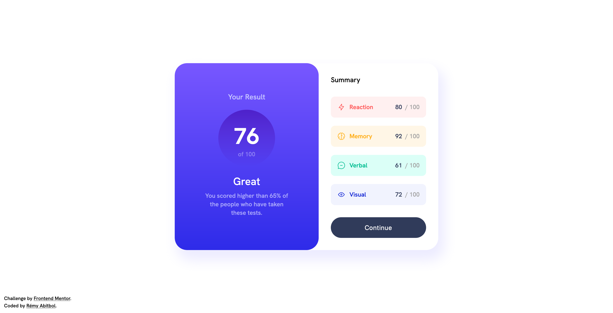
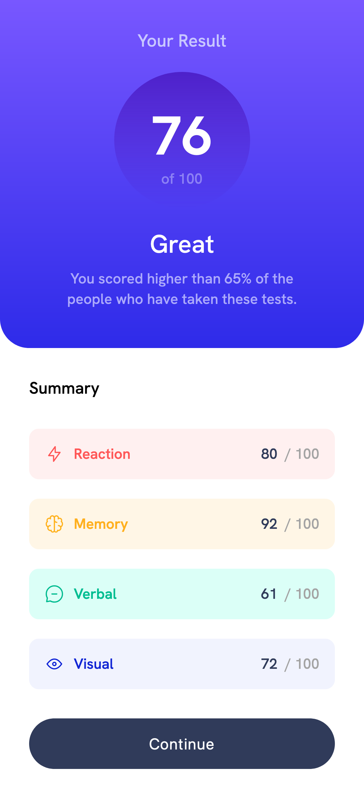

# Frontend Mentor - Results summary component solution

This is a solution to the [Results summary component challenge on Frontend Mentor](https://www.frontendmentor.io/challenges/results-summary-component-CE_K6s0maV).
Frontend Mentor challenges help you improve your coding skills by building realistic projects.

## Table of contents

- [Overview](#overview)
    - [The challenge](#the-challenge)
    - [Screenshot](#screenshot)
    - [Links](#links)
- [My process](#my-process)
    - [Built with](#built-with)
    - [Useful resources](#useful-resources)
- [Author](#author)

## Overview

### The challenge

Users should be able to:

- View the optimal layout for the interface depending on their device's screen size
- See hover and focus states for all interactive elements on the page
- **Bonus**: Use the local JSON data to dynamically populate the content

### Screenshots

<div style="display: flex; align-items: center; gap: 40px;">
<div>



</div>
<div>



</div>
</div>

### Links

- Solution URL: [GitHub](https://github.com/remscodes/frontend-mentor-challenges/tree/main/newbie/results-summary-component)
- Live Site URL: [GitHub Pages](https://remscodes.github.io/frontend-mentor-challenges/newbie/results-summary-component)

## My process

### Built with

- Semantic HTML5 markup
- CSS custom properties
- Flexbox
- JavaScript
- Web Component

### Useful resources

- Online Color Picker to find the proper background color of : https://www.w3schools.com/colors/colors_picker.asp

- Use font from `https://fonts.googleapis.com` instead of the one from `./assets`. Add the following into index.html :

```html
<link rel="preconnect" href="https://fonts.googleapis.com">
<link rel="preconnect" href="https://fonts.gstatic.com" crossorigin>
<link href="https://fonts.googleapis.com/css2?family=Hanken+Grotesk:wght@500;700;800&display=swap" rel="stylesheet">
```

## Author

- Website - [Rémy Abitbol](https://portfolio.rems.dev)
- GitHub - [remscodes](https://github.com/remscodes)
- Frontend Mentor - [@remscodes](https://www.frontendmentor.io/profile/remscodes)
